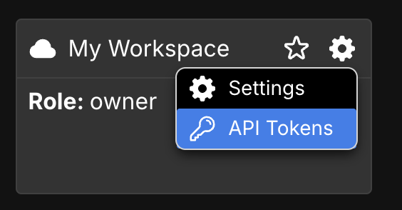
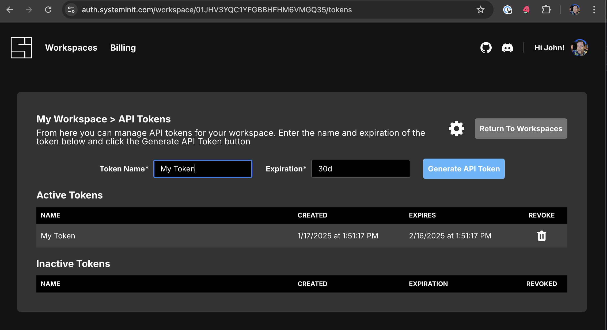
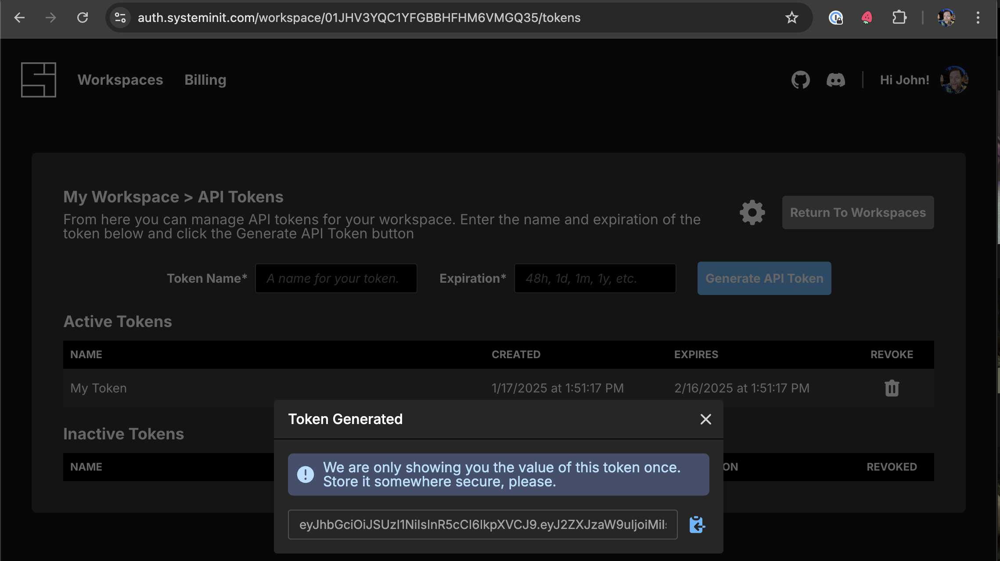

# System Initiative GitHub Actions

Use System Initiative workspaces in your github workflows!

NOTE: this is in early private access, and not yet publicly available.

## Trigger

Triggers a
[management function](https://www.systeminit.com/blog/announcing-management-functions),
so you can deploy real infrastructure based on your changes.

### Usage

```yaml
- uses: ./trigger # jkeiser/si-github-action/trigger@main
  with:
    changeSetName: CI
    componentId: 01JH3DZW0QTMH69ZA45299GSWY
    domain: |
      a: new A
      c: new C
      point/x: new x
    managementPrototypeId: 01JHRX9AMGMEFSE5JKXV70AWQG
    viewId: 01JATWJV2RA407RZFZBQ9PT5ES
    apiToken: ${{ secrets.SI_API_TOKEN }}
```

### Input

The `with` section is where you put the input properties that tell SI what to
run and what properties to set:

- `apiToken` is the API token you use to access SI from github actions (see
  [Getting an API Token](#getting-an-api-token)). We recommend using a secret
  here, like `apiToken: ${{ secrets.SI_API_TOKEN }}`.
- `changeSetName` is the name of the change set to create when the action runs.
  (You may alternately specify `changeSetId` if you want to use an existing
  change set.)
- `componentId` is the ID of the management component.
- `domain` is the list of properties you want to set on your component. You can
  specify the names of each property you want to set directly (like
  `CidrBlock`), followed by their value. Any properties you do not specify will
  be left alone with their current value.

  If you have a nested object (like a "point" object with "x", "y" and "z"
  properties) you can use a path to the individual property as its name (e.g.
  `"point/x": "100"`.

  You may specify this as either YAML or JSON. (The `|` after `domain:` is
  important, as it must be passed in as a string!)

- `viewId` is the ID of the view containing the management component.
- `managementPrototypeId` is the ID of the management function attached to the
  component.

## Getting an API Token

To use these actions, you will need an API token. To get one:

1. Go to [https://auth.systeminit.com/workspaces](https://auth.systeminit.com/workspaces).
2. Click on the Gear icon in the workspace you'd like to use with System
   Initiative, and click API Tokens. 
3. Create an API token: fill in the name and how long before the token will
   expire, and click "Create API Token". 
4. Click the Copy button at the bottom right to copy the token, so that you can
   paste it wherever you like. 

We recommend placing the secret into a
[github secret](https://docs.github.com/en/actions/security-for-github-actions/security-guides/using-secrets-in-github-actions#creating-secrets-for-a-repository)
so you can access it in workflows with `{{ secrets.SI_API_TOKEN }}` (though you
can name it whatever you like)! The examples on this page all assume you have
placed it into a repository secret named SI_API_TOKEN.
